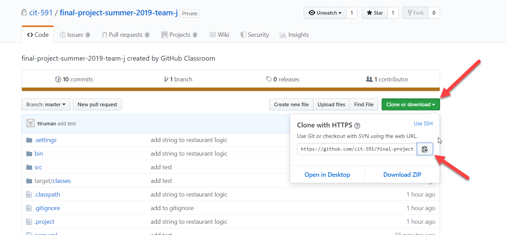

# Venue Recommender

## Overview
The venue recommender allows you to put in a US zipcode plus the type of venue you are looking for (ie Laundroment, Sushi, Groceries, etc) and it will return a list of venues closest to you.  It will even show you the current temperature just in case you need to grab a jacket on your way out.
Under the hood this project uses the FourSquare api to get the venue information and the OpenWeatherMap api to get the weather information.

## Import Instructions

This is a maven project.  To successfully import into Eclipse please follow the steps below:

1. Display the Git Repositories pane

    a. Click Window > Show View > Other 

    b. Choose Git Repositories
    
    c. Click "Open"
    
    
    
    This will display a pane like the below somewhere in your Eclipse.
    

2. Click to Clone a Git Repo and add to view

    
    
    
3. Copy clone link from Github page
    
    
    
4. Paste link into Eclipse window (if you haven't done this from github before you'll have to enter your credentials)
    
    
    
5. Click Next until you get to the window below, at which time you'll want to choose where the project gets stored on your local disk (the default is fine), also make sure you check the "Import all existing Eclipse projects after clone finishes" box.

    
    
6. Once you've done that you should see the project in your Project Explorer

    
    
    
## Run Instructions
 After importing the project just run the UserInterface class and start finding venues close to you!